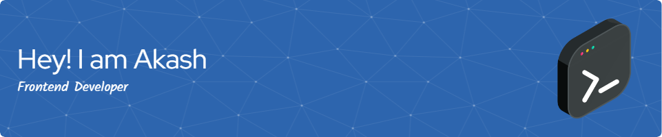

<h1 align="center">Hi 👋, I'm Akash Kute</h1>
<h3 align="center">A passionate frontend developer from India</h3>

- 🌱 I’m currently learning **Vue and everything.**

- 💬 Ask me about anything [here](https://mail.google.com/mail/?view=cm&fs=1&to=kuteakash51@gmail.com&su=&body=), I'm happy to help.

- ⚙️ I use daily: `.js`, `.jsx`, `.ts`,`.tsx`, `.html`, `.css`, `.scss` 

- ⚡ Fun fact **I firmly believe that '404' is the area code for the lost internet.**

<h3 align="left">Connect with me:</h3>

 

<h3 align="left">Languages and Tools:</h3>
            

